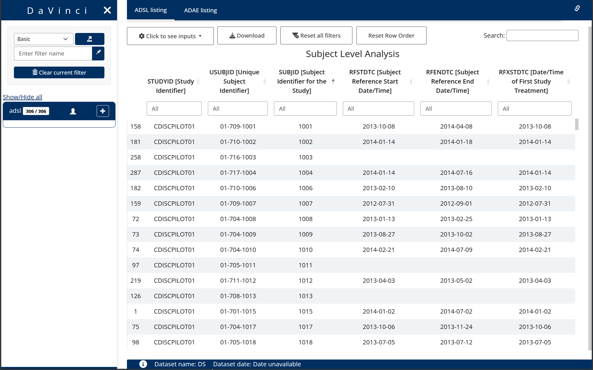

<!-- README.md is generated from README.Rmd. Please edit that file -->

# dv.manager

<!-- badges: start -->

[](https://www.tidyverse.org/lifecycle/#experimental)

<!-- badges: end -->

**dv.manager** package is designed to make it quick and easy to create
and deploy Shiny applications using the modules from DaVinci.



# Installation

``` r
install.packages("dv.manager", repos = TODO)
```
