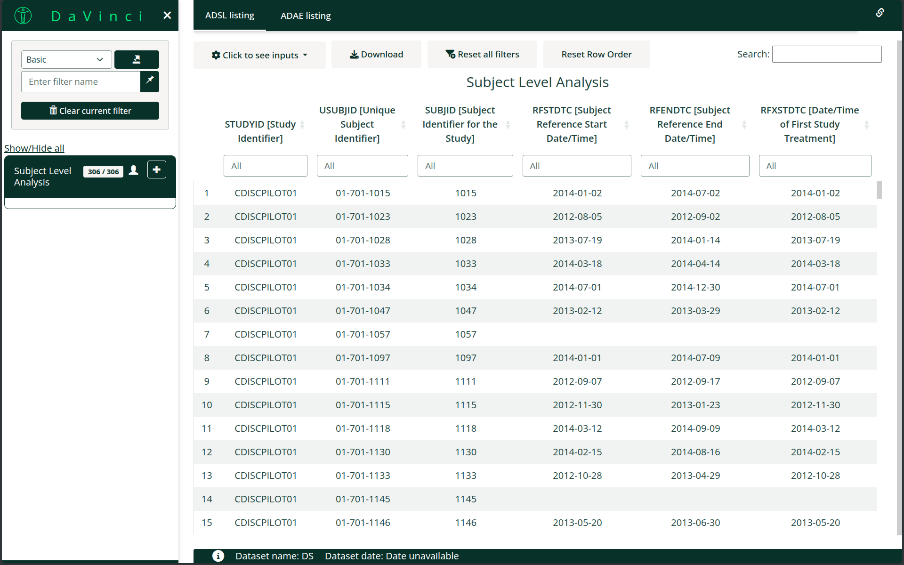

# dv.manager

**dv.manager** package is designed to make it quick and easy to create
and deploy Shiny applications using the modules from DaVinci.



# Installation

``` r

if (!require("remotes")) install.packages("remotes")
remotes::install_github("Boehringer-Ingelheim/dv.manager")
```
