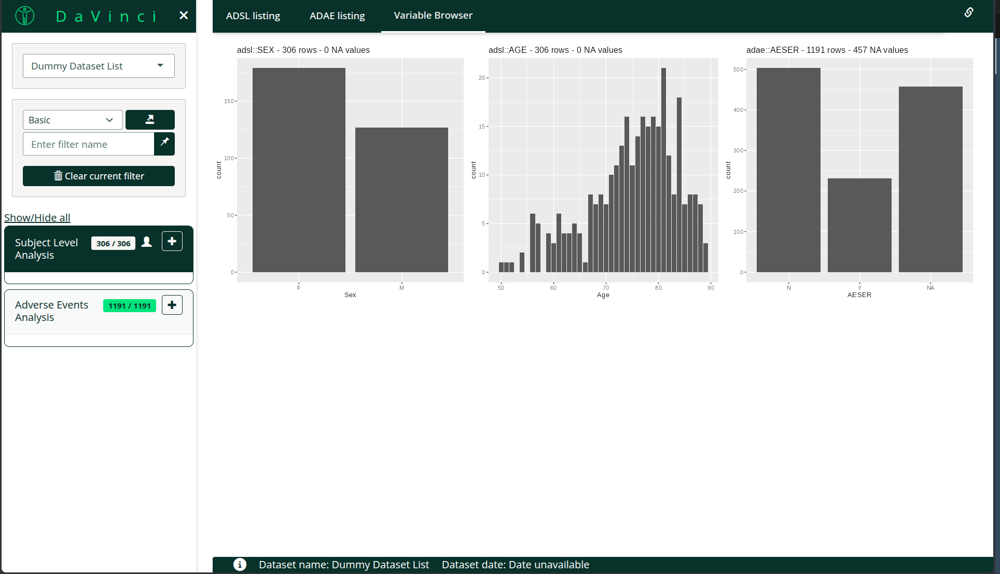
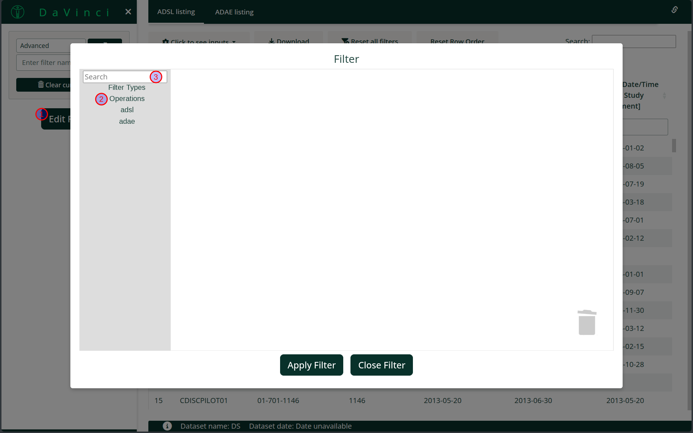

```{r, include = FALSE}
knitr::opts_chunk$set(
  collapse = TRUE,
  comment = "#>",
  tidy = "styler"
)
```

## Using the Development Filter

**Note that this filter is still in development stage and should not be used in production apps.**

This filter will replace the previous filter system in the DaVinci apps. This filtering is more performant and has
extended capabilities to cover a wider range of use cases.

To activate this functionality, you only have to set the `filter_type` argument to `development`.

{width=100%}

The filter is located in the sidebar, and it is divided in three main zones:

  1. dataset selector that allows switching between datasets in the application.

  2. general filter options and actions

  3. filter body and selectors

This new filter has two different interfaces a *simple* one and a *blockly* one. Both have the same mission, but the 
latter has a *block* interface that allows expressing richer filters when required.

Before describing each filter (*simple* or *blockly*), it is important to understand the two levels at which filters can be applied.

## Filtering levels

### Dataset filters

These filters apply to a single dataset. They are used to select specific rows within that dataset.

### Subject or subpopulation filters

These filters apply across all datasets in the application. They are used to select a subpopulation that spans all datasets.

## Simple filter

The interface displays one filter box per dataset. Inside each box, you can add filters for the variables available in that dataset.

For each variable filter, you can:

  - Select a set/range of values from the variable

  - Choose whether to include or exclude missing (NA) values

One dataset is always marked with a silhouette icon, showing it is being used as the **subpopulation filter**. The remaining datasets act as **dataset filters**.

Each dataset header also shows the number of rows included after the filters are applied.

See below an example of the usage of the filter:

  - Apply a **subpopulation filter** to select **female participants aged 60 to 70** years. Notice how this filter also applies to the `adae` dataset.

  - Apply a **dataset filter** to the `adae` dataset to include only **Serious Adverse Events**.

  - Exclude **Serious Adverse Events** coded as NA.

**Click on the image for a bigger version**
<a href="images/simple_filter.gif" target="_blank">
  
</a>

Notice filters can be collapsed by clicking the dataset name.

## Saving/Restoring states, clearing all filters and exporting the current state to a file

As shown in the example, you can save a filter state and restore it later.
You can also clear all filters or export the current filter state to a file.
The exported file can then be reused in the application as a preset filter.

``` {r, eval = FALSE}

dv.manager::run_app(
  ...,
  filter_type = "development",
  filter_default_state = "path/to/filter/file.json"
)
```


Now let's switch to the **Blockly Filter** . To switch between filter types, use the dropdown menu in the top section (marked as 1).
When you change the filter type, the current state of the filter is preserved.

## Blockly Filter

{width=100%}

In this interface, you will notice there are no filters on the left side. Instead, you will see a **Show Filter** button (1).

Clicking this button opens the filter modal, where you can design your filter.

The Blockly filter works as follows:

  - Select blocks from the categories (2), or search for them using the search box (3).

  - Drag the blocks into the canvas (4) and connect them to build your filter.

<div class="alert alert-info" role="alert">
  Once your filter is created, click **Apply filter** (5). Unlike the simple filter, Blockly filters are **not applied automatically** — you must apply them explicitly.
</div>

### Description of pieces

#### Filter Type Pieces

All filters start with one of the pieces under the **Filter Types** section, placed at the root of the filter.
Only one of each type can be present in the canvas at any given time — for example, one describing the filtering for the `adae` dataset, another for the `adlb` dataset, and so on.

{width=100%}

The same concepts of *Subject filter* and *Dataset filter* applies in this filter. Each filtering concept corresponds to a specific piece type:

  - The **Subject filter piece**, which applies across all datasets

  - A **Dataset filter piece** for each individual dataset


#### Variable Pieces

In the toolbox, each dataset has its own section. Under each section you will find a piece for every variable in that dataset.
Drag these pieces into the canvas to create filters.

{width=100%}

In the animation above, a simple filter is created for the `adae` dataset to include only rows where the *Lowest Level Term* is *ABDOMINAL CRAMPS*.

To build more complex filters, you can use the combination operations available in the **Operations** toolbox section.

#### Operation Pieces

Operation pieces are divided into two groups:

  - Pieces used to combine **variable pieces**

  - Pieces used to combine **sets**

#### Combining Variable participantsieces

The **and**, **or**, and **not** operations combine variable pieces from the same dataset.
These are purple-colored and located in the **Operations** section of the toolbox.

{width=100%}

For example, you can create filters on the `adae` dataset such as:

  - *Lowest Level Term* is *ABDOMINAL CRAMPS* **and** *Severity* is *SEVERE*
  - *Lowest Level Term* is *ABDOMINAL CRAMPS* **or** the *Severity* is *SEVERE*
  - *Lowest Level Term* is *ABDOMINAL CRAMPS* **or** the *Severity* is **not** *SEVERE*

There is no single way to express a filter — the same logic may be built with different variable selections or operation combinations.

#### Combining Sets 

The **union**, **intersect**, and **complement** operations ([see set operations](https://en.wikipedia.org/wiki/Set_(mathematics)#Basic_operations))
combine sets to select a subpopulation across the entire application. These are green-colored and can also be found in the **Operations** section of the toolbox.

For example:

  - All *Female* subjects aged between *60* and *70* **intersect** with all subjects who experienced any adverse event with *Severity* *SEVERE*.
  - All *Female* subjects aged between *60* and *70* **union** all subjects who experienced any adverse event with *Severity* *SEVERE*.
  - All *Female* subjects aged between *60* and *70* **union** with the **complement** of all subjects who experienced any adverse event with *Severity* *SEVERE*.

{width=100%}

#### Piece Restrictions

Several restrictions prevent incorrect configurations of the filter:

- *Variable* and *Combining variable* pieces can have any parent.
- *Combining variable* pieces can only have children that are either a *combining variable* piece or a *variable* piece.
- All *variable* pieces under a given *combining variable* piece (regardless of depth) must belong to the same dataset.
- *Combining set* pieces can only have a parent that is either another *combining set* piece or the *Subject Filter* piece.
- *Combining set* pieces can have any type of piece as children.

The application enforces these rules and prevents invalid configurations.

{width=100%}

### Searching for Pieces

The toolbox includes a search box at the top that lets you search for pieces across all sections.

{width=100%}

<div class="alert alert-info" role="alert">
You must enter at least three characters before the search will begin.
</div>

## Example application

Below is an example application that allows testing the Blockly filter:

``` {r, eval=FALSE}
# Note ::: is used as several of the functions are not exported yet
# until a final version of the filter is provided

dv.manager::run_app(
  data = list(
    "D0" = list(
      adsl = dv.manager:::get_pharmaverse_data("adsl"),
      adae = dv.manager:::get_pharmaverse_data("adae")
    ),
    "D2" = list(
      adsl = dv.manager:::get_pharmaverse_data("adsl"),
      adae = dv.manager:::get_pharmaverse_data("adae")
    )
  ),
  module_list = list(
    "Listing" = dv.listings::mod_listings("mod_listing", c("adsl", "adae"))
  ),
  filter_data = "adsl",
  filter_key = "USUBJID",
  filter_type = "blockly"
)
```


## Known issues and FAQ

- Is bookmarking supported?
  - Yes.
- One of the "AND"/"OR" pieces has no connections, what should I do?
  - Delete the piece and drag a new one into the canvas.
- The search box does not work?
  - You must enter at least three characters before the search will start.
- I applied the filter, but no filtering occurs.
  - Check for unconnected pieces. Any piece that is not connected prevents the filter from being applied.
- A selection for a categorical variable is not applied correctly.
  - Ensure that the category dropdown menu is closed after selecting the values.
