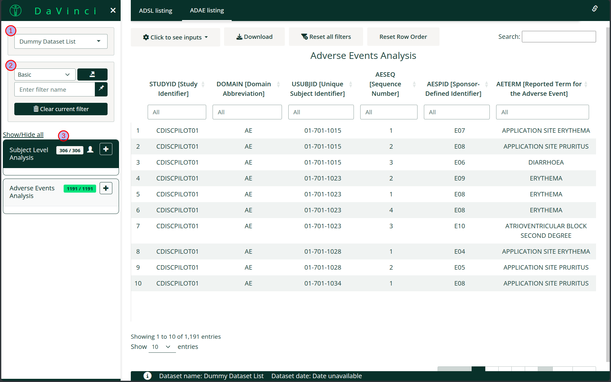
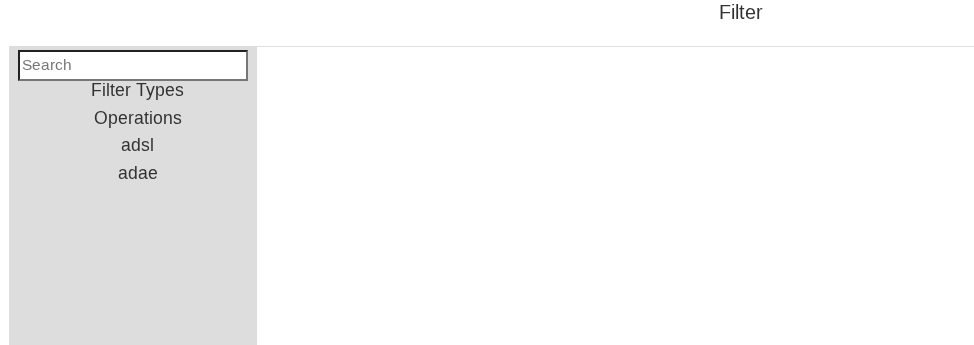
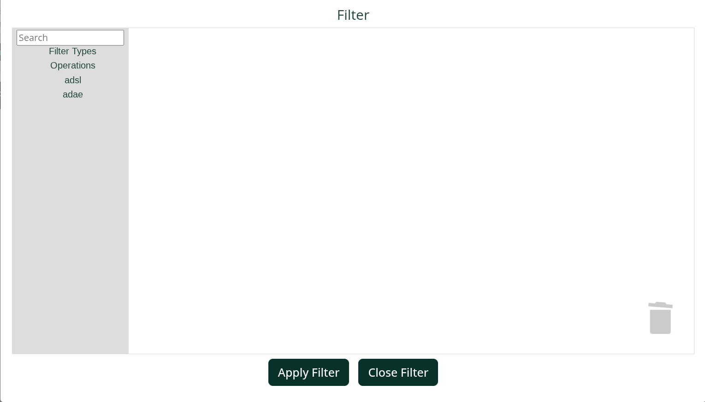
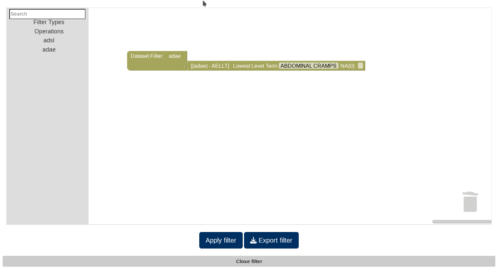
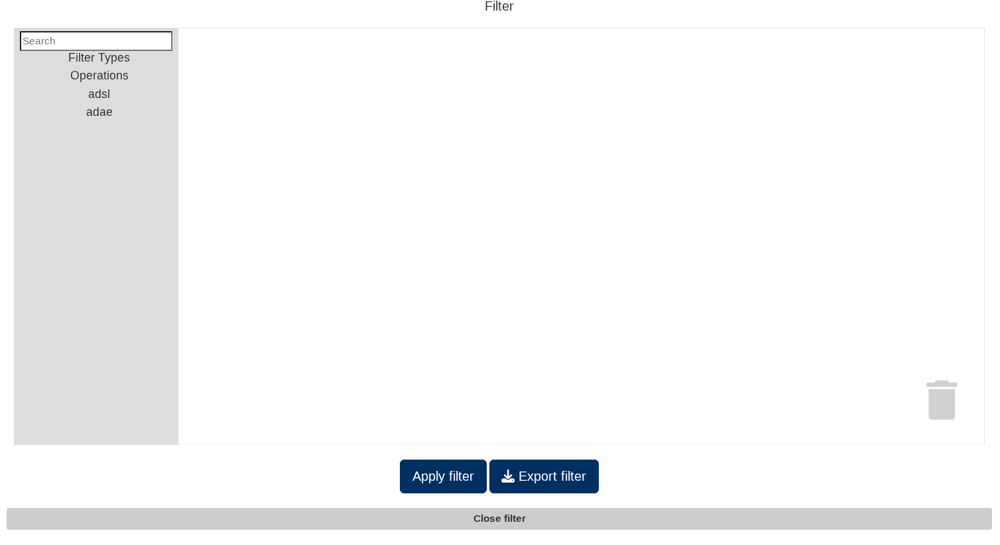
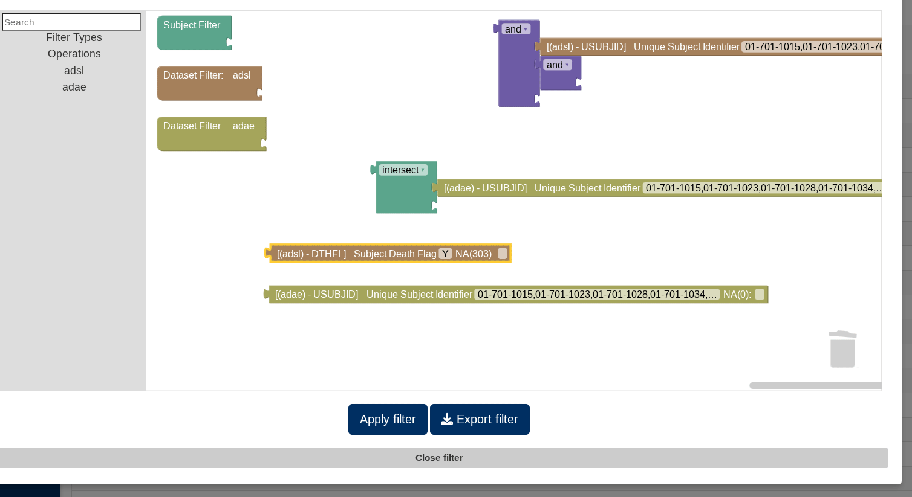
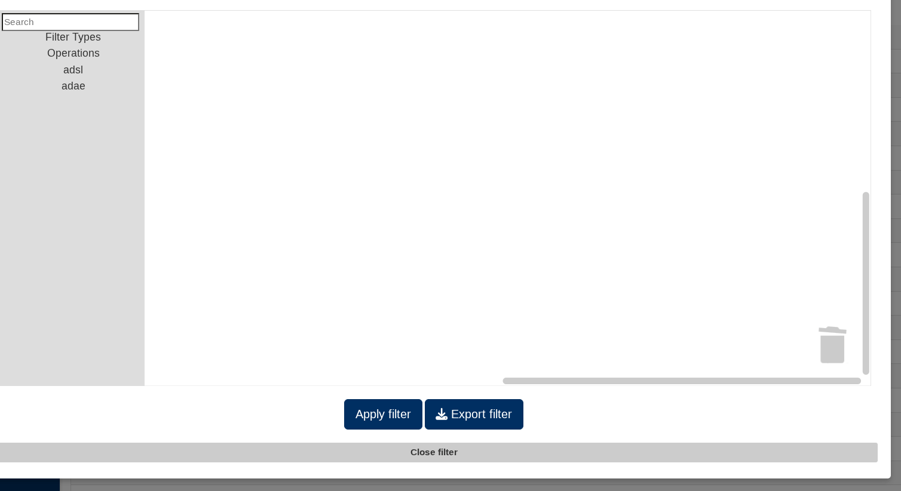

```{r, include = FALSE}
knitr::opts_chunk$set(
  collapse = TRUE,
  comment = "#>",
  tidy = "styler"
)
```

## Using the development blockly Filter

**Note that this filter is still in development stage and should not be used in production apps.**

To activate this functionality, you only have to set the `filter_type` argument to `blockly`.

{width=100%}

On this application you will notice that there are no filters on the left side but only a "Show filter" (1) button appears.
When clicked this button will open the filter modal where you can design your filter.

The filter works by selecting blocks from the categories (3), or by searching using the search box in (4),
in to the canvas (2) that then are connected to create a filter.

<div class="alert alert-info" role="alert">
  Once a filter is created it can be applied by pressing the "Apply filter" (5). Notice that, opposed to the previous
filter, it is not applied automatically and it must be applied explicitely.
</div>

## Description of pieces

### Filter Type pieces

All filters start with one of the pieces under the **Filter Types** section at the root of the filter. Only one of each of these pieces
can be present in the canvas at any moment, one describing the filtering for the *adae* dataset, another for the *adlb* dataset, etc.

{width=100%}

Notice that there two main types of filters, *Dataset Filters* and *Subject Filters*.

#### Dataset filters

These filters are designed to affect a single dataset, the name of the piece indicates which dataset is affected by the
filter. These filters are used to select **rows** of a given dataset.


#### Subject or subpopulation filters

These filters are designed to affect all the datasets in the application. These filters are used to select a **subpopulation** that 
across all datasets.

In following sections we will explain more about both types of filters and how the filters are created.


### Variable pieces

In the toolbox there will be one section per dataset in the application. Under each of this sections you will find a piece
for each of the variables in the dataset.

You can drag these pieces to create filters.

{width=100%}

In the animation above we have created a simple filter that filters the *adae* table to rows in which the *Lowest Level Term*
is *ABDOMINAL CRAMPS*

To create more complex filters we will use the combination operations available in the *Operations* toolbox section.

### Operation pieces

Operation pieces are divided in two big groups:

  - Pieces used to combine variable pieces
  - Pieces used to combine sets

#### Combining variable pieces

First we will describe the **and**, **or** and **not** operations used to combine variable pieces from the same dataset.
These are purple-colored and can be found under the *Operations* section in the toolbox.

{width=100%}

These pieces allow to create more complex filters, for example in the gif above we create a filter  that filters the
*adae* table to rows in which:

  - The *Lowest Level Term* is *ABDOMINAL CRAMPS* **and** the *Severity* is *SEVERE*
  - The *Lowest Level Term* is *ABDOMINAL CRAMPS* **or** the *Severity* is *SEVERE*
  - The *Lowest Level Term* is *ABDOMINAL CRAMPS* **or** the *Severity* is **not** *SEVERE*

There is not a single way of expressing a filter, therefore the same filter may be expressed, by different selections
in the variable menus, or by different Combining Operations.

#### Combining sets 

First we will describe the **union**, **intersect** and **complement** operations ([see](https://en.wikipedia.org/wiki/Set_(mathematics)#Basic_operations))
used to combine sets to select a subpopulation of interest across the whole application.

These are green-colored and can be found under the *Operations* section in the toolbox.

For example in the gif below we create a filter selects a subpopulation that contains:

  - All *Female* subjects between *60* and *70* **intersect** all subjects that have had any adverse event with *Severity* *Severe*.
  - All *Female* subjects between *60* and *70* **union** all subjects that have had any adverse event with *Severity* *Severe*
  - All *Female* subjects between *60* and *70* **union** with the **complement** of all subjects that have had any adverse event with *Severity* *Severe*

{width=100%}

#### Piece restrictions

Several restrictions are in place to avoid incorrect configurations of the filter:

- *Variable* and *Combining variable* pieces can have any parent.
- *Combining variable* pieces can only have as children another *Combining variable* piece or a *variable* piece.
- Any *variable* pieces under a given *combining variable* piece, regardless of depth, must belong to the same dataset.
- *Combining set* pieces can have as parent another *combining set* piece or the *Subject Filter* piece.
- *Combining set* pieces can have any piece as children.

The controls in the application prevent that any of the above actions is performed in the filter canvas.

{width=100%}

#### Searching for pieces

The toolbox include a search box on top that allows searching for pieces across all sections.

{width=100%}

<div class="alert alert-info" role="alert">
At least three characters must be used in the search box before it starts searching.
</div>

## Example application

Find below an application that allows testing the filter.

``` {r, eval=FALSE}
# Notice the usage of ::: as several of the functions are not exported yet
# until a final version of the filter is provided

dv.manager:::run_ap(
  data = list(
    "D0" = list(
      adsl = dv.manager:::get_pharmaverse_data("adsl"),
      adae = dv.manager:::get_pharmaverse_data("adae")
    ),
    "D2" = list(
      adsl = dv.manager:::get_pharmaverse_data("adsl"),
      adae = dv.manager:::get_pharmaverse_data("adae")
    )
  ),
  module_list = list(
    "Listing" = dv.listings::mod_listings("mod_listing", c("adsl", "adae"))
  ),
  filter_data = "adsl",
  filter_key = "USUBJID",
  filter_type = "blockly"
)
```

## Exporting a filter and using it as a preset filter

A given state of the filter can export a filter to a file using the "Export Filter" button. This file can then be used in the app call
as a preset filter.

``` {r, eval = FALSE}
# Notice the usage of ::: as several of the functions are not exported yet
# until a final version of the filter is provided

dv.manager:::run_app(
  ...,
  filter_type = "blockly",
  filter_default_state = "path/to/filter/file.json"
)
```


## Known issues and FAQ

- Is bookmarking supported?
  - Yes.
- One of the "AND"/"OR" pieces has no connections, what do I do?
  - Delete it and drag a new one.
- The search box does not work?
  - At least three characters must be used in the search box before it starts searching.
- I have applied the filter but no filtering is happening.
  - Check that there are no unconnected pieces. If any piece is not connected the filter cannot be applied.
- I have made a selection for a categorical variable but it is not correctly applied.
  - When selecting categorical variables it is required that the dropdown menu is closed before the selection can be applied.
