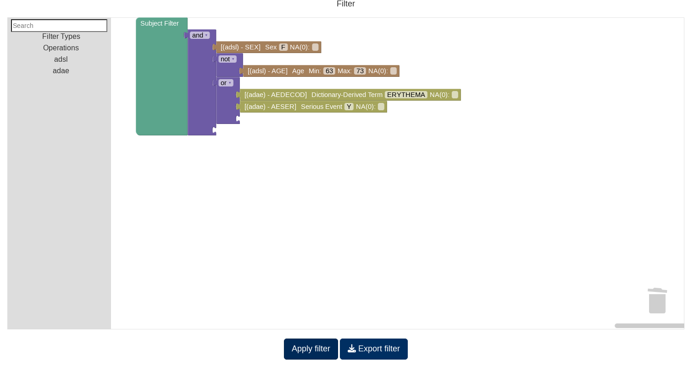

```{r, include = FALSE}
knitr::opts_chunk$set(
  collapse = TRUE,
  comment = "#>",
  tidy = "styler"
)
```

## Using the development blockly Filter

**Note that this filter is still in development stage and should not be used in production apps.**

To activate this functionality, you only have to replace the `run_app` call with `run_app_dev_filter`.

{width=100%}

On this application you will notice that there are no filters on the left side but only a "Show filter" (1) button appears.
When clicked this button will open the filter modal where you can design your filter.

The filter works by selecting blocks from the categories (3), or by searching using the search box in (4),
in to the canvas (2) that then are connected to create a filter.

Once a filter is created it can be applied by pressing the "Apply filter" (5). Notice that, opposed to the previous
filter, it is not applied automatically and it must be applied explicitely.

## Subject filter

This filter is used to select a subpopulation. You can find it in the *"Filter Types"* category.

It will filter all the tables for the subjects that match a specific set of conditions. For example, in the image below
we have created a filter that filters for all subjets that:

- Are Female
- Are not in the 63 to 73 range
- And have had Erythema or a Serious Adverse Event

{width=100%}

## Dataset filter

These set of filters are used to filter a single table from the dataset. You can find them in the *"Filter Types"*
category.

It will filter a single table, and will have no impact on the rest of the tables. For example, in the image below
we have created a filter for the "adae" table, where only "Erythemas" or "Adverse Event" rows are included.

{width=100%}

## Creating our first filter


``` {r, eval=FALSE}
# Notice the usage of ::: as several of the functions are not exported yet
# until a final version of the filter is provided

dv.manager:::run_app_dev_filter(
  data = list(
    "D0" = list(
      adsl = dv.manager:::get_pharmaverse_data("adsl"),
      adae = dv.manager:::get_pharmaverse_data("adae")
    ),
    "D2" = list(
      adsl = dv.manager:::get_pharmaverse_data("adsl"),
      adae = dv.manager:::get_pharmaverse_data("adae")
    )
  ),
  module_list = list(
    "Listing" = dv.listings::mod_listings("mod_listing", c("adsl", "adae"))
  ),
  filter_data = "adsl",
  filter_key = "USUBJID"
)
```

  - Open the "Filter" modal.
  - Click on the "Filter Types" category.
  - Drag the "Subject Filter" block into the canvas.
  - Open the "adsl" category and drag the "AGE" block into the canvas.
    - Alternatively, type "AGE" in the search box.
  - Connect the "AGE" block to the "Subject Filter" block.
  - Click on any of the values in the "AGE" block to open the slider and select a range.
  - Close the slider.
  - Apply the filter.

Now lets modify it:

  - Disconnect the "AGE" block by dragging it away from the "Subject Filter" block.
  - Open the "Operations" category.
  - Drag an "AND" block into the canvas.
    - You can change the operation using the dropdown in the block.
  - Connect the "Subject Filter" block to the "AND" block.
  - Connect the "AGE" block to the "AND" block.
  - Drag the "SEX" block from the "adsl" category into the canvas and connect it to the "AND" block.
  - Click on the selected values in the "SEX" block to open the dropdown menu and select only the "F" value.
  - Close the dropdown menu.
  - Apply the filter.

## Exporting a filter and using it as a preset filter

Now you can export a filter to a file using the "Export Filter" button. This file can then be used in the app call
as a preset filter.

``` {r, eval = FALSE}
# Notice the usage of ::: as several of the functions are not exported yet
# until a final version of the filter is provided

dv.manager:::run_app_dev_filter(
  ...,
  state = "path/to/filter/file.json"
)
```


## Known issues and FAQ

- Is bookmarking supported?
  - Yes.
- One of the "AND"/"OR" pieces has no connections, what do I do?
  - Delete it and drag a new one.
- The search box does not work?
  - At least three characters must be used in the search box before it starts searching.
- I have applied the filter but no filtering is happening.
  - Check that there are no unconnected pieces. If any piece is not connected the filter cannot be applied.
- I have made a selection for a categorical variable but it is not correctly applied.
  - When selecting categorical variables it is required that the dropdown menu is closed before the selection can be applied.
