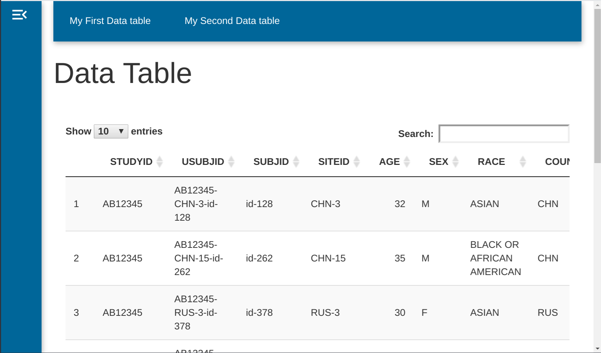
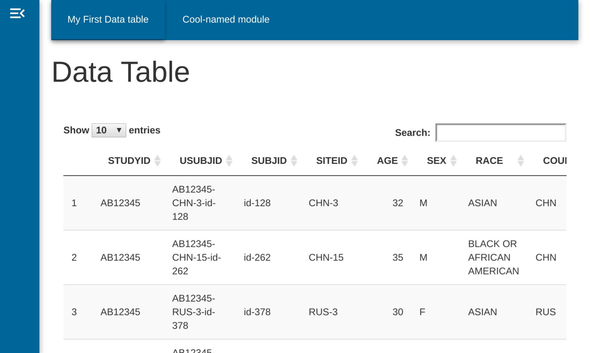

```{r, include = FALSE}
knitr::opts_chunk$set(
  collapse = TRUE,
  comment = "#>",
  tidy = "styler"
)
```

**dv.manager** offers a lot of options to customize our application. Here we present examples of these options. For this example, we will use as a base the application below.

```{r, eval=FALSE}
data <- list(
  adsl = pharmaverseadam::adsl,
  adae = pharmaverseadam::adae
)

module_list <- list(
  "My First Data table" = dv.general::mod_data_table(
    dataset = dv.manager::mm_dispatch("filtered_dataset", "adsl"),
    module_id = "mod1"
  )
)

dv.manager::run_app(
  data = list("DS" = data),
  module_list = module_list,
  filter_data = "adsl"
)
```

{width="50%"}

The effect of the changes can be visualized by comparing the output before the customization (block above) and after the customization (blocks inside each example).

# Adding a new module

To add a new module we just have to add a new entry to the `module_list`, specifying which module we want to include in the application.

```{r, eval=FALSE}
data <- list(
  adsl = pharmaverseadam::adsl,
  adae = pharmaverseadam::adae
)

module_list <- list(
  "My First Data table" = dv.general::mod_data_table(
    dataset = dv.manager::mm_dispatch("filtered_dataset", "adsl"),
    module_id = "mod1"
  ),
  "My Second Data table" = dv.general::mod_data_table(
    dataset = dv.manager::mm_dispatch("filtered_dataset", "adsl"),
    module_id = "mod2"
  )
)

dv.manager::run_app(
  data = list("DS" = data),
  module_list = module_list,
  filter_data = "adsl"
)
```

{width="50%"}

The name of the entry in the list will serve as an external (i.e. human readable) identifier and `module_id` will act as an internal identifier.

Notice how we modified the `module_id` to `"mod2"` and also the name of the entry in the list.

Both must be **unique** across modules!

```{r, eval=FALSE}
### Repeated module_id
module_list <- list(
  "My First Data table" = dv.general::mod_data_table(
    dataset = dv.manager::mm_dispatch("filtered_dataset", "adsl"),
    module_id = "mod1"
  ),
  "My Second Data table" = dv.general::mod_data_table(
    dataset = dv.manager::mm_dispatch("filtered_dataset", "adsl"),
    module_id = "mod1"
  )
)

### Repeated module name
module_list <- list(
  "My First Data table" = dv.general::mod_data_table(
    dataset = dv.manager::mm_dispatch("filtered_dataset", "adsl"),
    module_id = "mod1"
  ),
  "My First Data table" = dv.general::mod_data_table(
    dataset = dv.manager::mm_dispatch("filtered_dataset", "adsl"),
    module_id = "mod2"
  )
)
```

# Renaming a module

If we want to change the display of a module we just have to modify the name of the appropriate entry.

If we want to change the module named "My Second Data table" to "Cool-named module", we just have to change the name of the entry in the module_list.

```{r, eval=FALSE}
data <- list(adsl = pharmaverseadam::adsl, adae = pharmaverseadam::adae)

module_list <- list(
  "My First Data table" = dv.general::mod_data_table(
    dataset = dv.manager::mm_dispatch("filtered_dataset", "adsl"),
    module_id = "mod1"
  ),
  "Cool-named module" = dv.general::mod_data_table(
    dataset = dv.manager::mm_dispatch("filtered_dataset", "adsl"),
    module_id = "mod2"
  )
)

dv.manager::run_app(
  data = list("DS" = data),
  module_list = module_list,
  filter_data = "adsl"
)
```

{width="50%"}

# Changing the data source

To modify a module so it has a different data source, we just have to modify the `dataset` parameter.

```{r, eval=FALSE}
data <- list(
  adsl = pharmaverseadam::adsl,
  adae = pharmaverseadam::adae
)

module_list <- list(
  "ADSL data table" = dv.general::mod_data_table(
    dataset = dv.manager::mm_dispatch("filtered_dataset", "adsl"),
    module_id = "mod1"
  ),
  "ADAE data table" = dv.general::mod_data_table(
    dataset = dv.manager::mm_dispatch("filtered_dataset", "adae"),
    module_id = "mod2"
  )
)

dv.manager::run_app(
  data = list("DS" = data),
  module_list = module_list,
  filter_data = "adsl"
)
```

Notice how both data tables are affected by the filter located in the sidebar.

This example contains modules that only need a single dataset. More complex modules may need more datasets, please refer to the documentation of each particular module.

{width="50%"}

# Loading several datasets in a single application

dv.manager offers the possibility of accessing several datasets in a single application.
To add a new dataset we just have to add a new entry to the list passed to the data parameter. This entry can be a list of dataframes, or a function that will return a list of dataframes.

```{r, eval=FALSE}
data1 <- list(adsl = pharmaverseadam::adsl, adae = pharmaverseadam::adae)
data2 <- list(adsl = pharmaverseadam::adsl, adae = pharmaverseadam::adae)

module_list <- list(
  "ADSL data table" = dv.general::mod_data_table(
    dataset = dv.manager::mm_dispatch("filtered_dataset", "adsl"),
    module_id = "mod1"
  ),
  "ADAE data table" = dv.general::mod_data_table(
    dataset = dv.manager::mm_dispatch("filtered_dataset", "adae"),
    module_id = "mod2"
  )
)

dv.manager::run_app(
  data = list(
    "DS1" = data1,
    "DS2" = data2
  ),
  module_list = module_list,
  filter_data = "adsl"
)
```


# Data preprocessing before app is launched

The application is not limited to load data directly. We can modify those datasets so we can explore our data in a more efficient way.

Lets imagine we want to:

1.  limit the filtering possibilities to just SEX and AGE

2.  treat SEX as a factor during filtering

3.  change the labels of some variables

Please visit the `vignette("data_filtering")` to understand why USUBJID is kept within the dataset.

```{r, eval=FALSE}
data <- list(
  adsl = pharmaverseadam::adsl,
  adae = pharmaverseadam::adae
)

# We will use dplyr to modify our data.
# This library has an extensive documentation,
# so if you have any particular doubt about the preprocessing itself,
# please refer to the documentation of dplyr.

library(dplyr)

# Create a new filtering dataset
data[["adsl_filter"]] <- data[["adsl"]] %>%
  select(USUBJID, SEX, AGE) %>%
  mutate(SEX = as.factor(SEX))

# Place new labels
attr(data[["adsl_filter"]][["SEX"]], "label") <- "Participant Sex"
attr(data[["adsl_filter"]][["AGE"]], "label") <- "Age (Years)"


module_list <- list(
  "ADSL data table" = dv.general::mod_data_table(
    dataset = dv.manager::mm_dispatch("filtered_dataset", "adsl"),
    module_id = "mod1"
  ),
  "ADAE data table" = dv.general::mod_data_table(
    dataset = dv.manager::mm_dispatch("filtered_dataset", "adae"),
    module_id = "mod2"
  )
)

dv.manager::run_app(
  data = list("DS" = data),
  module_list = module_list,
  filter_data = "adsl_filter"
) # We have changed the data source for the filtering
```

Notice how the filter only shows the selected data, and how the filtering differs depending on the data type. Please refer to **dv.filter**

The same approach can be used to, for example:

1.  reduce the number of variable presented in the data table

2.  recalculate a new variable age in months.

Notice at the bottom of the code block below we use the modified dataset for filtering.

```{r, eval=FALSE}
data <- list(
  adsl = pharmaverseadam::adsl,
  adae = pharmaverseadam::adae
)

library(dplyr)

# Create a new filtering dataset
data[["adsl_mod"]] <- data[["adsl"]] %>%
  select(USUBJID, SEX, AGE) %>%
  mutate(
    SEX = as.factor(SEX),
    AGE_M = AGE * 12
  )

# Place new labels
attr(data[["adsl_mod"]][["SEX"]], "label") <- "Participant Sex"
attr(data[["adsl_mod"]][["AGE_M"]], "label") <- "Age (Months)"


module_list <- list(
  "ADSL data table" = dv.general::mod_data_table(
    dataset = dv.manager::mm_dispatch("filtered_dataset", "adsl"),
    module_id = "mod1"
  ),
  "ADSL_mod data table" = dv.general::mod_data_table(
    dataset = dv.manager::mm_dispatch("filtered_dataset", "adsl_mod"),
    module_id = "mod2"
  )
)

dv.manager::run_app(
  data = list("DS" = data),
  module_list = module_list,
  filter_data = "adsl_mod"
) # We have changed the data source for the filtering
```
