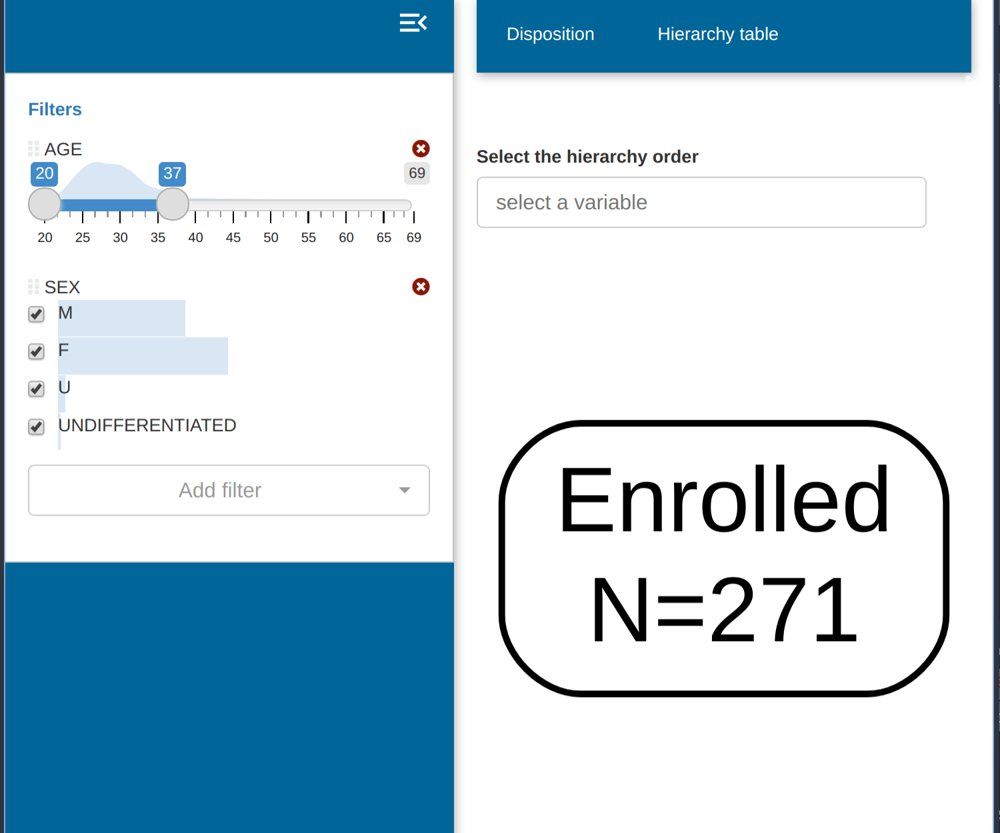
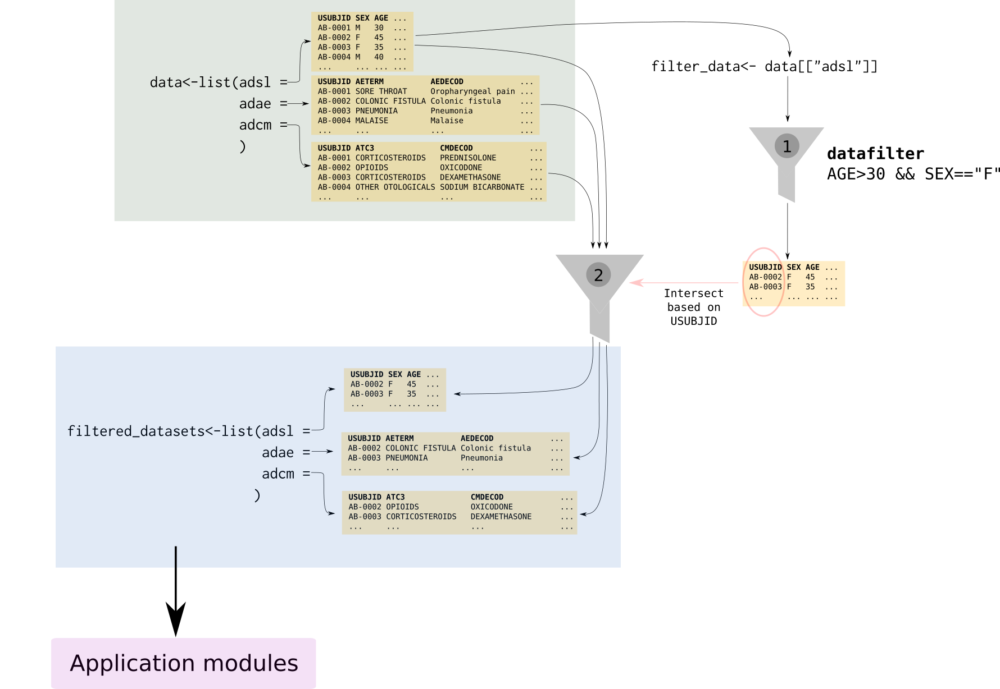

```{r, include = FALSE}
knitr::opts_chunk$set(
  collapse = TRUE,
  comment = "#>",
  tidy = "styler"
)
```

**dv.manager** include in all applications a filter for the input data.

{width=100%}

In the `run_app()` call we specify which dataset will be passed to dv.filter in the `filter_data` parameter. The fields of this dataset will be displayed in the filter.

```{r, eval=FALSE}
dv.manager::run_app(
  data = list("DS" = data),
  module_list = module_list,
  filter_data = "adsl"
) # Dataset used to filter other datasets
```

All datasets passed in the the `data` parameter will also be affected by this filtering. The **dv.manager**, by default, assumes that all datasets in `data` and `filter_data` have a common field "*USUBJID*". This field will be used as a common key to allow the filtering of all datasets in `data` based on the `filter_data` dataset. This filtering key can be modified in the `run_app()` call by modifying the parameter `filter_key`.

The figure below depicts the steps of the filtering process when using the default filtering key "USUBJID":

{width=100%}

In a first step (1), `filter_data` makes a subselection of all subjects in the study according to the criteria selected by the user (in the case of the figure only female participants above 30 years). In a second step (2), we filter the rest of the datasets in `data` and only those subjects that survived the filtering in step 1 will remain.


