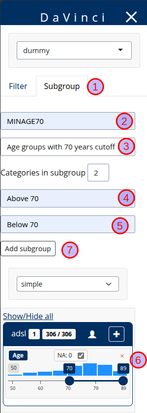
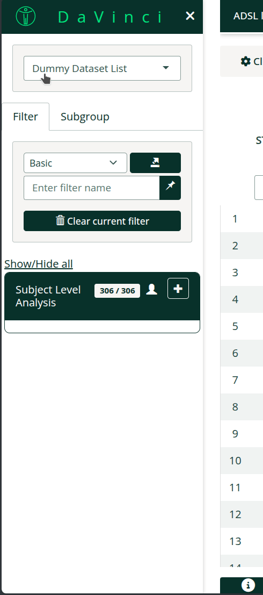

  

  **Note:**  
  This feature is currently under development. Its behaviour may change without notice.
  

The main purpose of this subgrouping feature is enabling users to quickly create **population** subgroups for exploration
directly in the application itself. It must be noted that it does not allow to create permanent groups and final
or complex subgroups should be created during data preprocessing before the application starts.

To active this feature you must set and  `enable_subgroup = TRUE` in the `run_app` call.

## How to create a 2 category subgroup
 
The subgroup menu is located on the sidebar under the tab **Subgroup** (1).

To create a subgroup follow the steps:

  - Choose a variable name for the subgroup (2).

    

    **Note:**  
    - Variable names that are already present in the dataset are not allowed. If a previous subgroup had the same variable name it will be overwritten.
    

  - Choose a label for the subgroups (3). This will be a human readable label that will be included in menus, tables, etc
  - Choose a label for the population that will pass the filter (4)
  - Choose a label for the population that will not pass the filter (5)
  - Use the filter controls below to define the subgroup (6)
  - Add the subgroup (7)

In the image we create a subgroup for a population with a cutoff of 70 years.

{width=100%}

## How to create a subgroup with more than 2 categories

It is possible to create a subgroup with more than two categories.

 - Select more than one categories in the dropdown menu.
 - Select a label for each of the categories.
 - Use the filter controls to define the subgroups for each category. Remember to click the assign group.
 - All subjects not included in any of the categories will automatically be assigned to the last one.

     

    **Note:**  
    Subjects cannot belong to two subgroups at once.
    

In the image we create a subgroup with three categories **>80**, **70-80** and **<70**. Notice how categories are
mutually exclusive, we select **81 to 89** and **70 to 80** in the filter controls. 

 

{width=90%}

In both cases more advanced subgroups can be created by using more filters or by switching to the `blockly` filter
as described in the [new filter](/articles/development_filter.html) article.

## FAQ

- Can I remove a subgroup? No, you cannot remove a subgroup but you can overwrite it.
- Does bookmark support subgroups? Yes, subgroups are supported by bookmarking.
- Is there anyway of including subgroups by default? No, and it will not be implemented. The subgroup can
be created during preprocessing before loading data in the application.
- Can I create based on another subgroup? No, subgroups can only be created based on original variables.